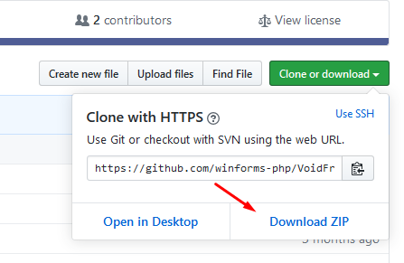

# Начало работы

 [](https://scrutinizer-ci.com/g/winforms-php/VoidFramework/?branch=master) [](https://scrutinizer-ci.com/g/winforms-php/VoidFramework/build-status/master) [](https://scrutinizer-ci.com/code-intelligence)

## Системные требования

| Требование | Значение |
| :--- | :--- |
| Версия **Windows** | ≥ **7** |
| Версия **.NET Framework** | ≥ **4.5.2** |
| Версия **Visual C++ Redistributable** | **2017** |

## Установка



```text
php Qero.phar install winforms-php/VoidFramework
```



Скачайте **GitHub** репозиторий проекта



Распакуйте архив с **VoidFramework** в папку проекта


Переместите папку `app_bundle` на уровень ниже распакованной папки **VoidFramework**'а и переименуйте её в `app`






Для установки настоятельно рекомендуется использовать [**Qero**](https://github.com/KRypt0nn/Qero). В дальнейшем все действия будут рассматриваться с учётом того, что **VoidFramework** был установлен именно таким образом


## Использование

После установки в проекте появится папка `app`. В ней будет располагаться будущее **VoidFramework**-приложение. В качестве точки входа используется файл `app/start.php`

Для запуска приложения вы можете прописать команду

```text
php Qero.phar start
```

или запустить файл `start.bat`

